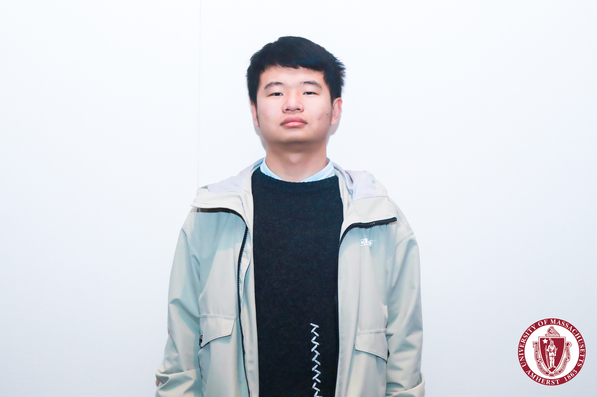

Bin Yu 于滨\
Master Candidate\
Department of Eletrical and Computer Engineering\
University of Massachusetts Amherst\
Email: biny at umass dot edu\
Long Introduction is [Here](Resume_Bin-Yu_PDF.pdf)
### Education
M.S. , Department of Electrical and Computer Engineering, University of Massachusetts , Massachusetts , US , Jan. 2020 - Present\
B.Eng. , Department of Industrial Engineering, University of Electronic Science and Technology of China ,  Sichuan, PR China , Sep. 2015 - Aug 2019\
Thesis: CuraEngine Aanalysis and Reconstruction\ 
Advisor: Associate Professor [Sijia Yu](https://www.smee.uestc.edu.cn/info/1177/8369.htm)
### Research
#### Interest
Probability Model\
Machine Learning
#### Pulications
<ins>Yu,B</ins>. A Deep Belief Network and Dempster-Shafer Theory Multiclassifier for Reliability of Wind Turbine System. The 10th International Conference on Quality, Reliability, Risk, Maintenance, and Safety Engineering. [[Code]](https://github.com/kyuBin422/DBN-DS-Multiclassifier)[[PDF]](https://drive.google.com/file/d/11ZKaIRoNQ6FFBc5W5U5qzgpTDDsowxj2/view)
